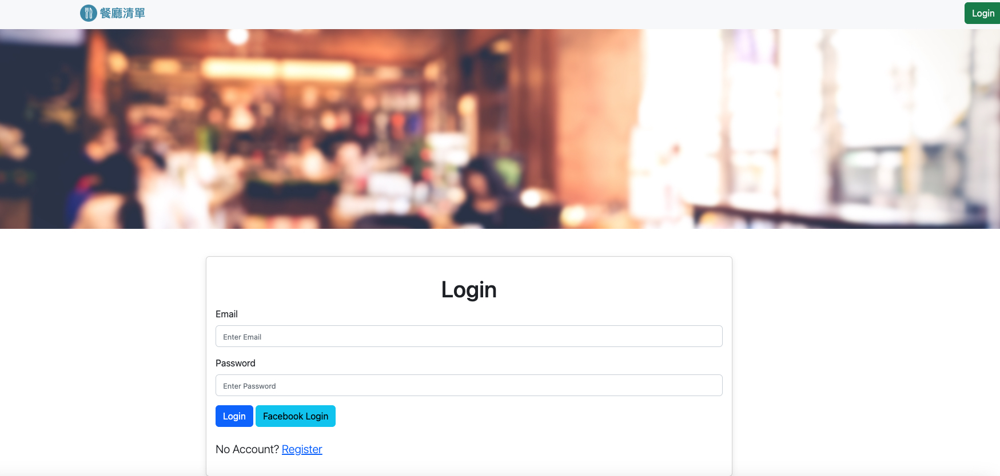

# AC-2-3-A7 Restaurant-List

Restaurant list created using node.js, mongodb and framework express.



## Features

- User Register
- User login / logout
- User Facebook login
- List all restaurants.
- Show restaurant detail.
- Search restaurant by name or category.
- New a restaurant,
- Edit a restaurant information.
- Delete a restaurant.
- Sorting Restaurants by Name or Rating.

## How to use

1. Clone the Repo to local server.
```bash
    git clone https://github.com/paulwu-tw/restaurants.git
```

2. Install need package by follow cmd.
```bash
    npm install
```

3. Accroding to .env.example file, config required info below.
```bash
    # Mongo db connect info
    MONGODB_URI=<Your own connection string>
    MONGODB_USER=<Username>
    MONGODB_PASSWORD=<Password>

    # Session secret
    SESSION_SECRET=<YOUR_SESSION_SECRET>

    # Facebook App info
    FACEBOOK_ID=SKIP
    FACEBOOK_SECRET=SKIP
```

4. Create test data
```bash
    npm run seed
```

- seed offer 2 account below
    
    ||Name|Email|Password|
    |:--|:--:|:--:|:--:|
    |1|user1|user1@example.com|12345678|
    |2|user2|user2@example.com|12345678|

5. Start server for demo.
```bash
    npm run start
```

6. While see the message below, open browser and enter the following URL. 
```bash
    Listen on http://localhost:3000
```

7. Stop server
```bash
    cmd + c
```

## Built with

- Node.js: 18.15.0
- MongoDB Altas
- Express: 4.18.2
- Express-handlebars: 7.0.7
- mongoose: 7.1.0
- dotenv: 16.0.3
- express-session: 1.17.3
- passport: 0.6.0
- passport-local: 1.0.0
- passport-facebood: 3.0.0
- bcryptjs: 2.4.3
